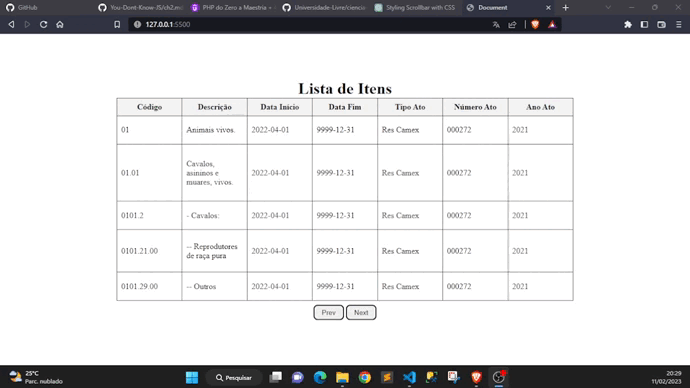

## Requisição e paginação em tabela html utilizando JQuery
Neste exemplo é feita uma requisição para a api [Brasil](https://brasilapi.com.br/docs) que retorna um grande volume de dados, para poder
inserir os dados sem travar o navegador, é necessário utilizar a estratégia de paginação e definir quantos
dados serão exibidos por página conforme ilustra a imagem:    

## Technologias
HTML  
CSS  
JQuery  

## Como utilizar?
Faça um clone do projeto.  
Pode executar abrindo o arquivo de HTML em uma aba do seu navegador. 